<h1 align="center">
  <br>
  💙 Satya Sai Medico
  <br>
  <sub>Hospital Management System</sub>
</h1>

<p align="center">
  <b>A production-grade full-stack hospital management system built with React.js, Spring Boot, and MySQL.</b>
  <br>
  Featuring OTP-verified appointment booking, WhatsApp integration, JWT authentication, and a complete admin dashboard.
</p>

<p align="center">
  
  
  
  
  
  
</p>

---

## 📸 Screenshots

### Public Pages
| Home | Services | Doctors |
|------|----------|---------|
| 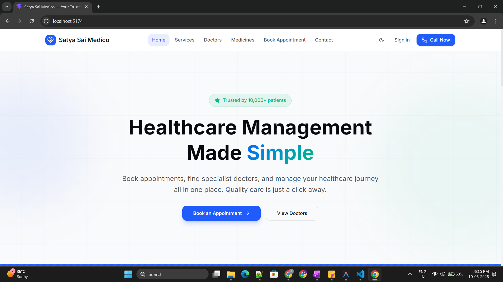 | 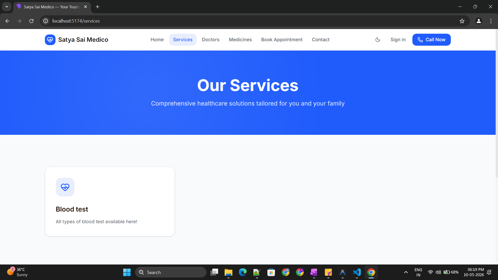 | 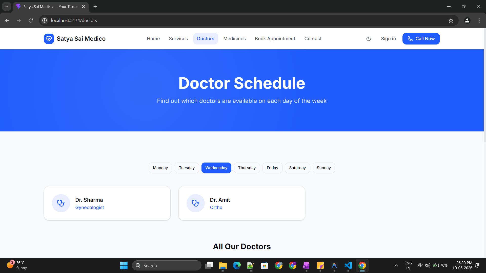 |

| Medicines | Appointment (OTP) | Contact |
|-----------|-------------------|---------|
| 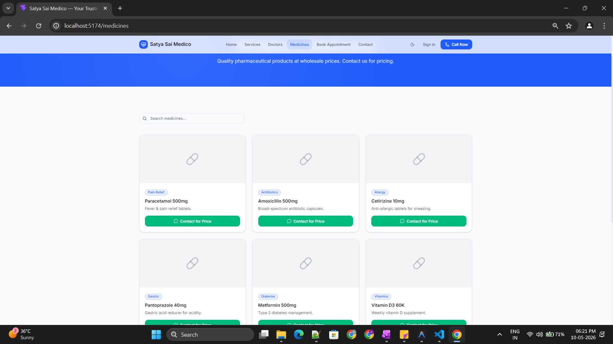 | 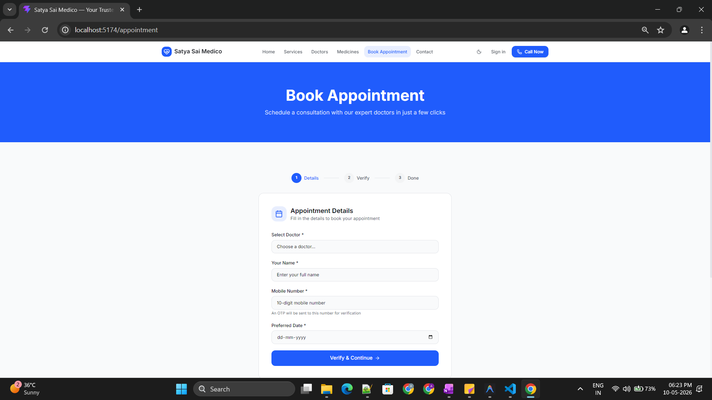 | 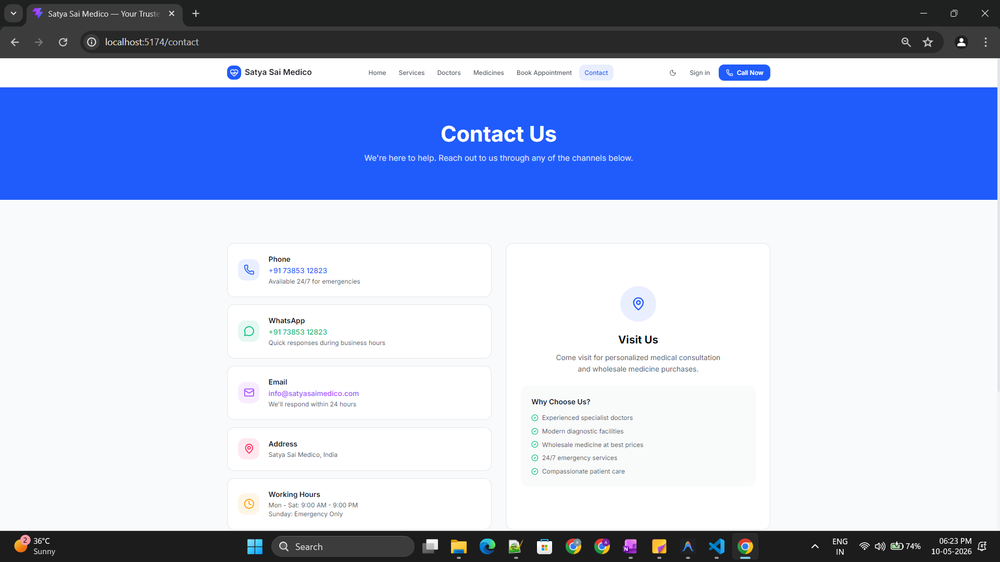 |

### Admin Panel
| Login | Dashboard | Doctor Management |
|-------|-----------|-------------------|
| 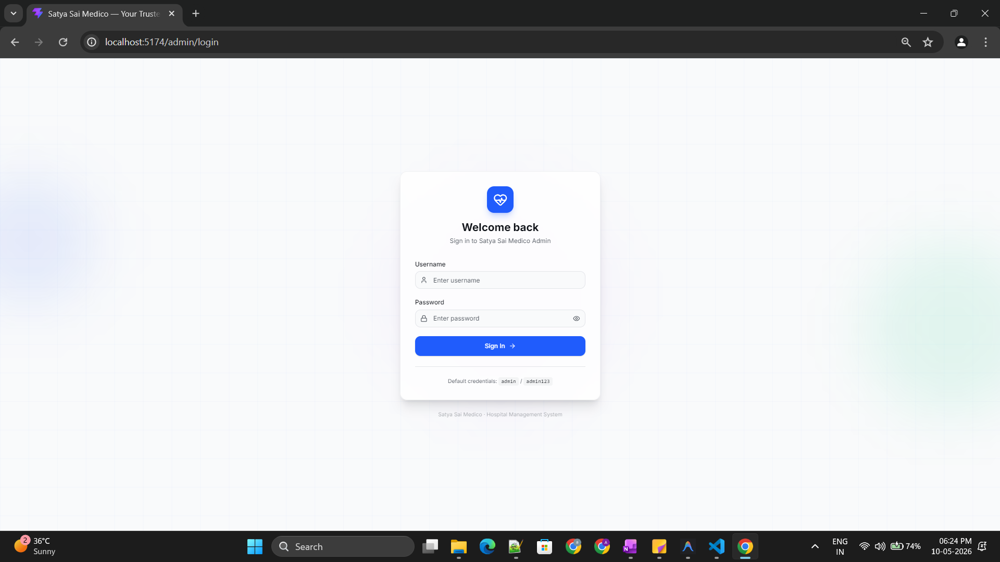 | 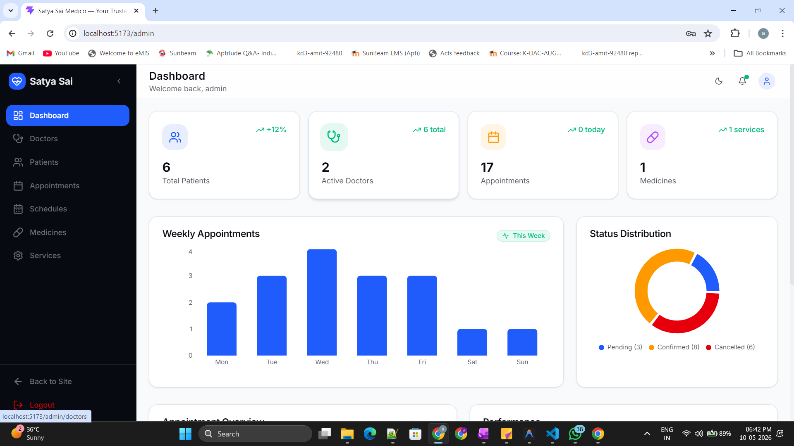 | 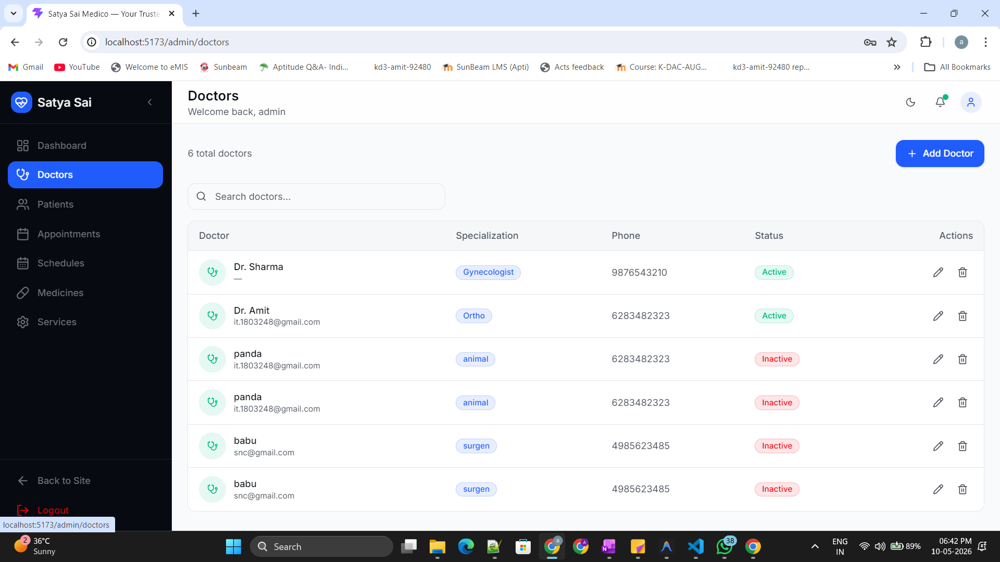 |

| Appointments | Medicines | Services |
|-------------|-----------|----------|
| 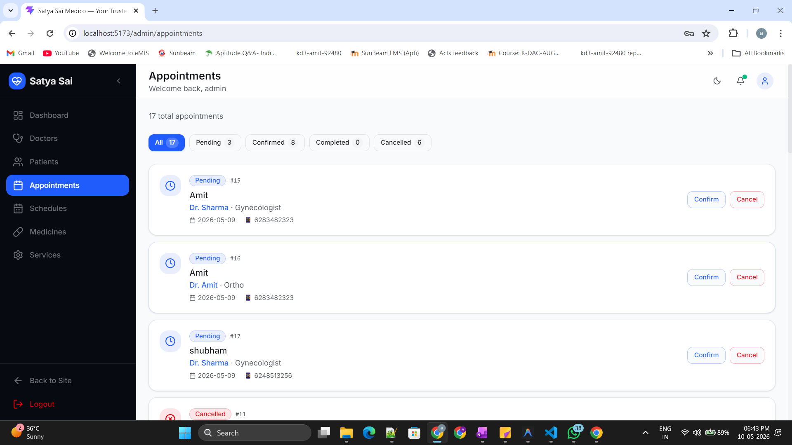 | 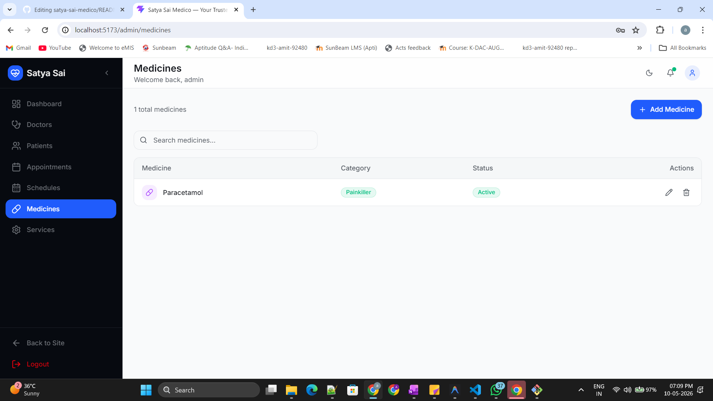 | 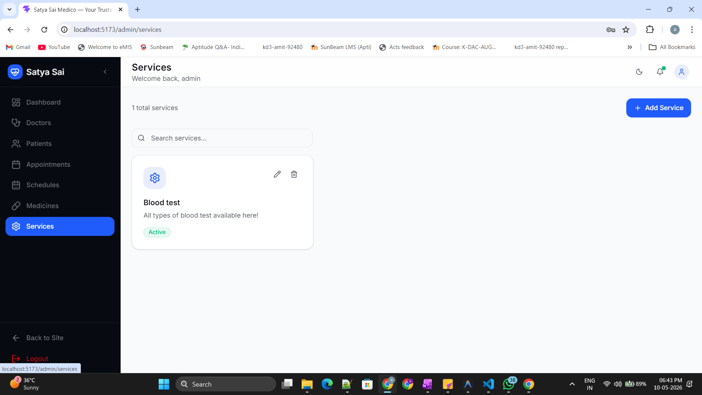 |

---

## ✨ Features

### 🌐 Public Portal (Patient-Facing)
- **Home Page** — Hero section with trust stats and doctor preview
- **Doctor Schedule** — Day-wise timetable with dynamic tab switching
- **Services Catalog** — Healthcare services with Lucide icons
- **Wholesale Medicines** — Searchable catalog + WhatsApp inquiry buttons
- **Appointment Booking** — 3-step wizard with **OTP mobile verification**
- **Contact Page** — Phone, WhatsApp, Email, Address with clickable actions

### 🔒 Admin Dashboard (Protected with JWT + RBAC)
- **Dashboard** — KPI stat cards, Recharts bar/donut charts
- **Doctor Management** — Full CRUD with search & pagination
- **Patient Management** — Patient list with verification badges
- **Appointment Management** — Status filter tabs, inline status updates
- **Medicine Management** — CRUD with category badges
- **Service Management** — CRUD with card grid layout

### 🔐 Security & Advanced Features
- **JWT Authentication** — Stateless auth with HS512 signed tokens
- **Role-Based Access Control** — Public, Authenticated, ADMIN roles
- **OTP Verification** — 6-digit OTP with 5-min expiry + brute-force protection
- **WhatsApp Integration** — Click-to-chat API for medicine inquiries
- **SMS Notifications** — Twilio integration for appointment confirmations (optional)
- **Global Error Handling** — Centralized exception handler with consistent JSON responses
- **Input Validation** — Backend (@Valid + Bean Validation) + Frontend (HTML5 + state checks)

---

## 🏗️ Architecture

```
┌──────────────────┐     ┌───────────────────┐     ┌─────────────┐
│   React.js SPA   │────▶│  Spring Boot API  │────▶│    MySQL    │
│  (Vite + TW v4)  │REST │ (Security + JWT)  │ JPA │  Database   │
└──────────────────┘     └───────────────────┘     └─────────────┘
         │                        │
    ┌────┴────┐              ┌────┴────┐
    │ Recharts│              │ Twilio  │
    │ Axios   │              │ WhatsApp│
    │ Lucide  │              │ BCrypt  │
    └─────────┘              └─────────┘
```

---

## 🛠️ Tech Stack

| Layer | Technology | Version |
|-------|-----------|---------|
| **Frontend** | React.js + Vite | 19.x + 8.x |
| **Styling** | Tailwind CSS (oklch tokens) | v4.2 |
| **Charts** | Recharts | 3.x |
| **Icons** | Lucide React | 1.x |
| **HTTP Client** | Axios (with interceptors) | 1.x |
| **Routing** | React Router | v7 |
| **Backend** | Spring Boot + Spring Security | 3.4 |
| **Auth** | JWT (HMAC-SHA512) | — |
| **ORM** | Hibernate / Spring Data JPA | — |
| **Database** | MySQL | 8.x |
| **SMS** | Twilio (optional) | — |

---

## 📁 Project Structure

```
satya-sai-medico/
├── backend/                          # Spring Boot REST API
│   └── src/main/java/com/satyasaimedico/
│       ├── config/                   # Security, CORS, DataSeeder
│       ├── controller/               # 10 REST controllers
│       ├── service/                  # 11 services (Auth, OTP, SMS, WhatsApp...)
│       ├── repository/               # 7 JPA repositories
│       ├── model/                    # 7 entities (Doctor, Patient, Appointment...)
│       ├── dto/                      # Request/Response DTOs
│       ├── security/                 # JWT filter, token provider
│       └── exception/               # Global exception handler
│
├── frontend/                         # React SPA
│   └── src/
│       ├── components/               # Navbar, Footer, AdminLayout
│       ├── context/                  # AuthContext
│       ├── pages/                    # 13 page components
│       ├── services/                 # api.js (Axios + interceptors)
│       └── index.css                 # Design system tokens
│
└── screenshots/                      # App screenshots for README
```

---


## 🔐 API Endpoints (22+)

### Public (No Auth Required)
| Method | Endpoint | Description |
|--------|----------|-------------|
| `GET` | `/api/doctors` | List active doctors |
| `GET` | `/api/services` | List active services |
| `GET` | `/api/medicines` | List all medicines |
| `GET` | `/api/schedules` | Doctor schedule (day-wise) |
| `POST` | `/api/appointments` | Book an appointment |
| `POST` | `/api/otp/send` | Send OTP to mobile |
| `POST` | `/api/otp/verify` | Verify OTP |
| `GET` | `/api/whatsapp/medicine?name=` | Get WhatsApp inquiry link |

### Auth
| Method | Endpoint | Description |
|--------|----------|-------------|
| `POST` | `/api/auth/login` | Login → returns JWT |
| `GET` | `/api/auth/me` | Validate token |

### Admin (JWT + ADMIN role required)
| Method | Endpoint | Description |
|--------|----------|-------------|
| `GET` | `/api/admin/dashboard/stats` | Dashboard statistics |
| `CRUD` | `/api/admin/doctors` | Doctor management |
| `GET` | `/api/admin/patients` | Patient list |
| `GET/PUT` | `/api/admin/appointments` | Appointment management |
| `CRUD` | `/api/admin/medicines` | Medicine management |
| `CRUD` | `/api/admin/services` | Service management |

---

## 🔑 Key Technical Decisions

| Decision | Why | Alternative |
|----------|-----|-------------|
| JWT over Sessions | Stateless, scalable REST API | Session (server-side state) |
| ConcurrentHashMap for OTP | O(1) lookup, thread-safe, ephemeral data | Redis (for multi-server) |
| BCrypt for passwords | Slow hash + auto-salt defeats brute force | SHA-256 (too fast) |
| Tailwind CSS v4 | Utility-first, oklch tokens, tiny bundles | Bootstrap (heavier) |
| Axios over fetch | Interceptors, auto-JSON, better errors | fetch (no interceptors) |
| Twilio made optional | App runs without external dependencies | Required (breaks locally) |

---

## 📄 License

This project is built for **Satya Sai Medico Hospital** as a production-level portfolio project.

---

<p align="center">
  Built with 💙 by <b>Amit</b> — React.js · Spring Boot · MySQL
</p>
